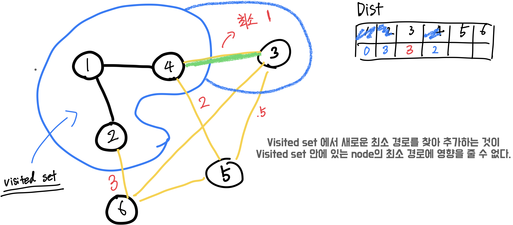

# Python-note
- 유용한 알고리즘에 대한 참고 노트 및 library
- 문제 풀이에 관한 Template 및 접근 방법에 대한 정리

## Syntax
- **Loop and Condition**
  - [for-if](./Syntax/Loop_and_condition.py)
  - [Pythonic Code](./Syntax/Pytonic_code.py)

- **Python Sort**
  - [다양한 sort 구현](./Syntax/Sorting.py)
  - [List built in 정렬](./Syntax/sort_built_in.py)
  - [compare key 정렬](./Syntax/cmp_to_key.py)
    
- **String Handling**
  - [List Sliceing and Indexing](./Syntax/sliceing_indexing.py)
  - [String Sliceing and Indexing](./Syntax/string.py)
  - regex
    
- **Dict**
  - [dict, defaultdict]
  - [Sorting, OrderedDict](./Syntax/dict_sorting.py)
    
    https://velog.io/@matt2550/%ED%8C%8C%EC%9D%B4%EC%8D%AC-Collections-%EB%AA%A8%EB%93%88-3%EC%A2%85-%EC%A0%95%EB%A6%AC

- **Data Structure**
  - [queue, dueue](Library/queue_deque.py)
  - [Counter](./Library/counter.py)
  - [heapq](./Library/heap.py)
  - Linked_list
  - [itertools (순열,조합,중복조합,중복순열)](./Library/itertools.py)

- **Matrix handling**
  - [90-degree Matrix rotation](./Library/matrix_rotation.py)
  - [Matrix Rotation](./Library/[TODO])

- **Iterable Type Change**
  - [List_Set_Tuple_Dict]()

- **Math**  
  - Math library
  - [Check Prime Number](./Math/prime.py)
  - [에라토스테네스의 채](./Math/prime.py)
  - Find All Divisors 
  - Prime Factorization
## 알고리즘 유형에 따른 Tip 

### 그리디

문제를 가장 쉽게 접근하는 방법 중에 하나이지만, 그리디로 풀리는지 증명하는 과정이 매우 어렵다.
그리디 알고리즘을 적용하기전에, 그렇게 해도 최적의 해가 보장되는지 증명하고 접근하는 것이 좋다.
문제를 보았을 때, 초기에 DP와 Greedy 유형을 헷갈리기 쉽다.

### Binary search, parametric search

- 문제에서 어떤 조건을 만족시키는 최대, 최소값을 찾기
- 탐색 범위가 1억 ~ 10억 이상이면 이분탐색의 가능성을 의심

```python
# 이분탐색 template  
left = 0
right = 10 ** 10 # some large number
result = 0
while left <= right:

    mid = (left + right) // 2
            
    if is_possible(mid): # <- 높은 값 탐색 
        result = mid # min(result, mid)
        left = mid + 1
    else: # <- 낮은 값 탐색
        right = mid - 1
```

- biselect


### BFS/DFS

#### BFS
순간의 상태를 queue 에 저장 -> info  
**info** : (현재위치, 이동횟수, 이동방향, 남은 스킬 사용횟수, etc..) 들을 묶어서 큐에 append
**visited** : 튜플의 크기만큼 지정

```python
q = [start]
visited[start] = true

while q:
  here = q.pop(0) #deque 사용시 popleft()
  
  for there in adj[here]:
    #out of index check
    #if 
    if visited[there]: continue
    q.push(there)

```    
- 문제 [TODO]

#### DFS

```python

def dfs(here):
  visited[here] = true
  for there in adj[here]:
    if visited[there]: continue
    dfs(there)

```
- 문제 [TODO]


### Dijkstra [TODO]

- 출발지에서 모든 노드에 대한 최단 경로를 구하는 알고리즘


**간단한 Dijkstra**
- get_smallest_node() -> 방문하지 않은 노드에서 최소 간선을 가지는 노드를 찾음
- O(V^2)

- visited 에 들어있는 노드가 새로운 최소 경로를 갖는 노드가 들어왔을 때 값이 변화가 없을까?



- [간단한 다익스트라](./Problem_category/Dijstra_simple.py)
```python
def get_smallest_node():
    #방문하지 않은 노드 중 최소 노드를 찾음
    min_value = INF
    index = 0
    for i in range(1, n + 1):
        if dist[i] < min_value and not visited[i]:
            min_value = dist[i]
            index = i
    return index

def dijkstra_1(start):
    dist[start] = 0 # 첫번째 값 초기화
    
    visited[start] = True

    #첫번째 방문 초기화
    for j in graph[start]:
        dist[j[0]] = j[1]

    for i in range(n - 1):
        # 최단 경로의 노드를 꺼내 방문 처리 -> visited set 등록
        now = get_smallest_node()
        visited[now] = True

        for j in graph[now]:
            cost = dist[now] + j[1]

            # 다를 노드를 거쳐 이동하는게 짧을 경우 dist 업데이트
            if cost < dist[0]:
                dist[j[0]] = cost
```

**힙을 사용하는 다익스트라**
- O(ElogV) 
- **heapq** 를 사용

- [heap 다익스트라](Problem_category/Dijstra_heap.py)
```python
def dijkstra(start):
    q = []

    heappush(q,(0, start)) # distance, node
    distance[start] = 0

    while q:
        dist, now = heappop(q)

        # 이미 업데이트 된 경로인지 확인
        if distance[now] < dist:
            continue

        for i in graph[now]:
            cost = dist + i[1] # i : (node, cost)

            # 현재 노드를 거쳐 다른 노드로 이동 하는 경우가 더 짧다면 distance table 업데이트
            if cost < distance[i[0]]:
                distance[i[0]] = cost
                heappush(q, (cost, i[0]))
```

### Floyd–Warshall algorithm
- 모든 지점에서 모든 지점까지의 최단경로
- 
### Minimum Spanning Tree (MST)
### Topology Sort
### BackTracking
### 누적합
### Bitmasking

비트마스킹(Bitmask)
입력으로 주어지는 수나 특정 조건의 범위가 10 이하로 매우 작다면 사용을 의심해볼 수 있다.
어떤 상태를 저장하기에 매우 용이하고, 응용하여 가능한 모든 조합을 탐색하는 방법에도 사용할 수 있다.
비트마스킹의 장점은 단 하나의 수만으로 여러 상태를 저장할 수 있는 것!!

**예를 들어 8개의 전구가 있고 2번째, 5번째 전구가 켜져있는 상태를 표시하고 싶다면**
```python
bulb_status = 0 # 초기상태 (모든 전구가 꺼짐)     0000 0000
bulb_status |= (1 << 2) # 2 번째 전구 ON         0000 0100
bulb_status |= (1 << 5) # 5 번째 전구 ON         0010 0100
```

- Bitmasking


### Divid and Cunquer

**TBD**

### Disjoint-Set (Union-Find)

```python
#노드 부모 세팅
parent = [i for i in range(0, n+1)]

#특정 노드의 루트 찾기
def find(x):
    if parent[x] != x:
        return find(parent[x])
    else:
        return parent[x]

#두 노드 합치기
def union(a , b):
    p_a = find(a)
    p_b = find(b)

    if p_a < p_b:
        parent[a] = p_b
    else:
        parent[b] = p_a
    
#경로 압축
def find_parent():
    if parent[x] != x:
        parent[x] = find_parent(parent[x])
    else
        parent[x]
```

### Two Pointer

### Dynamic Programming
문제를 풀고 해결방법을 구상하다가 중복되는 연산이 자주 등장하거나, 어떤 상태를 만족하기 이전 상태에서도 최적의 상태를 만족해야할 때 사용

그리디 알고리즘과 동적계획법 둘 중에 어떤 것을 사용해야하는지 감이 잡히지 않을 때

문제의 풀이 방법이 증명 가능하며, 중복된 연산이 많이 등장하지 않는 경우: 그리디 알고리즘
문제의 풀이 방법에 대한 증명이 잘 떠오르지 않고, 중복되는 연산이 여러번 등장하는 경우: 동적계획법
감이 잡히지 않을 때는, 가장 기초 문제부터 많은 양의 문제를 풀며 생각하는 힘을 기르는 것이 좋다 😄

동적계획법 중에서도 유명한 문제유형들 (Knapsack problem, LIS(Longest Increaseing Subsequence), LCS(Longest Common Subsequence), 외판원순회문제(TSP)) 은 따로 익히는 것이 좋다. 특히 LIS, LCS, 냅색문제는 잘 나오기 때문에 확실하게 알고있는 것이 문제를 풀 때 도움이 된다.

LIS 알고리즘의 경우, 동적계획법을 이용한 풀이와, 이분탐색을 이용한 풀이 2가지 방법이 모두 존재하므로 모두 알아두고 있으면 좋다

아직 많은 코딩테스트를 참여하지는 않았지만, 개인적으로 문제를 풀면서 유명한 DP알고리즘을 적용한 문제보다는 직접 점화식을 생성하는 문제가 더 자주 등장하는 것 같음!

- 1. 재귀를 사용한 Top Down 방법
```python
memo = [[-1] * N for _ in range(N)]
```
완전탐색을 하되, 이미 연산한 부분에 대해서는 가지치기를 진행하는 방법
N의 크기가 너무 커지면 python에서는 재귀호출 횟수제한에 걸려서 오류가 발생할 수 있음!
처음에 완전탐색으로 생각을 시작해서 최적화하기에 좋은 코드!
```python
def dp(n):
# 기저사례 (base condition)
if n <= 1: return n

# 메모이제이션 (memoization)
if memo[n] != -1: return ret

# 재귀연산
memo[n] = dp(n - 1) + dp(n - 2)
return memo[n]
```
- 2. Bottom Up 방법
단순 반복문을 사용하는 방법이지만, 점화식을 세워 그대로 적용시켜야한다.
```python
memo = [0] * N
memo[1] = 1
for i in range(2, N):
  memo[i] = memo[i - 2] + memo[i - 1] 
# 이런 상태들을 저장하는데 단 하나의 숫자형 변수를 사용!
```

## TBD
- Bipartite Matching
- Tree
- Line
- Plane
- KMP
- Trie
- Tiling Problem
- 0-1 Knapsack Problem
- LIS (Longest Increasing Subsequence)
- LCS (Longest Common Subsequence)
- Matrix Chain Multiplication
- Geometry
- CCW
- Convex Hull
- FFT

### Miscellaneous
- Number of intervals whose sum is M
- Interval Sum
- Prefix Sum
- Fenwick Tree (Binary Indexed Tree)
- Handling Recursion Limit